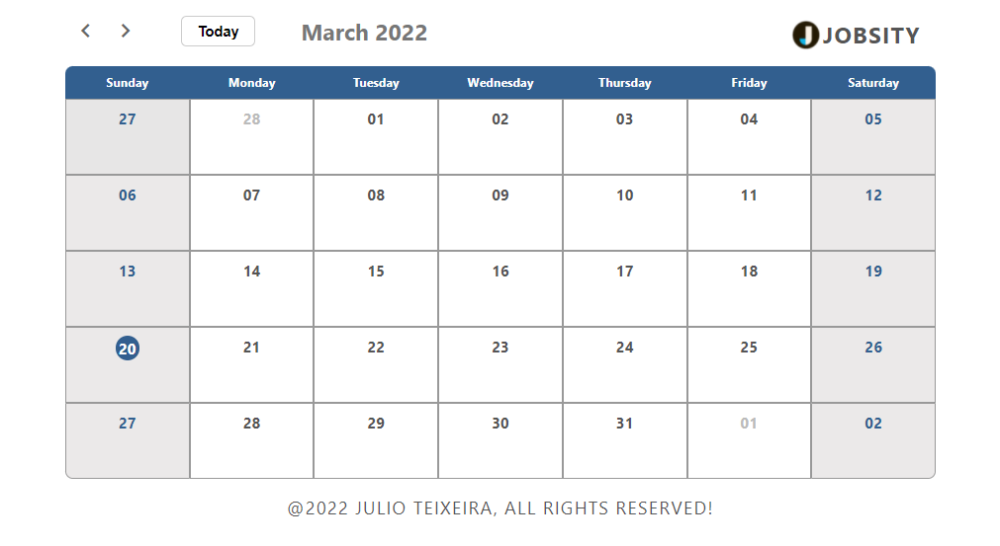
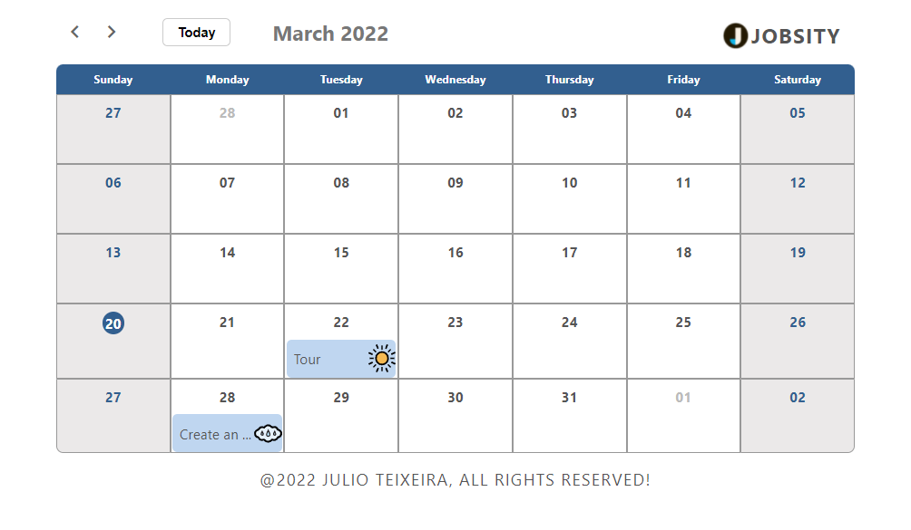
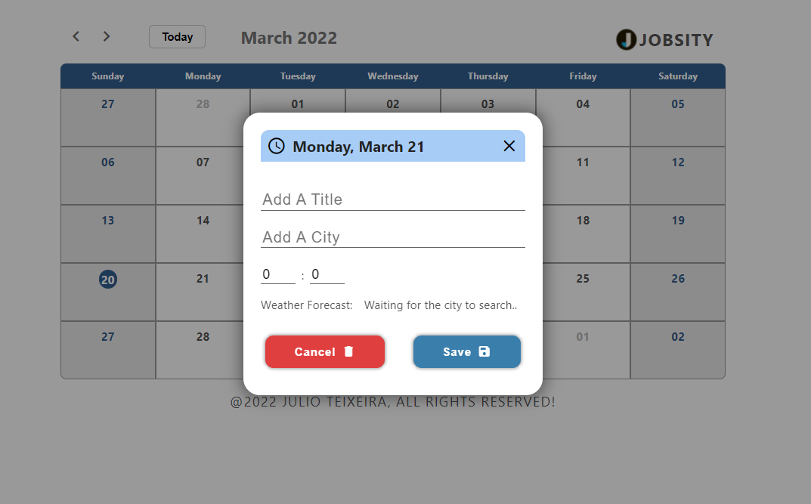
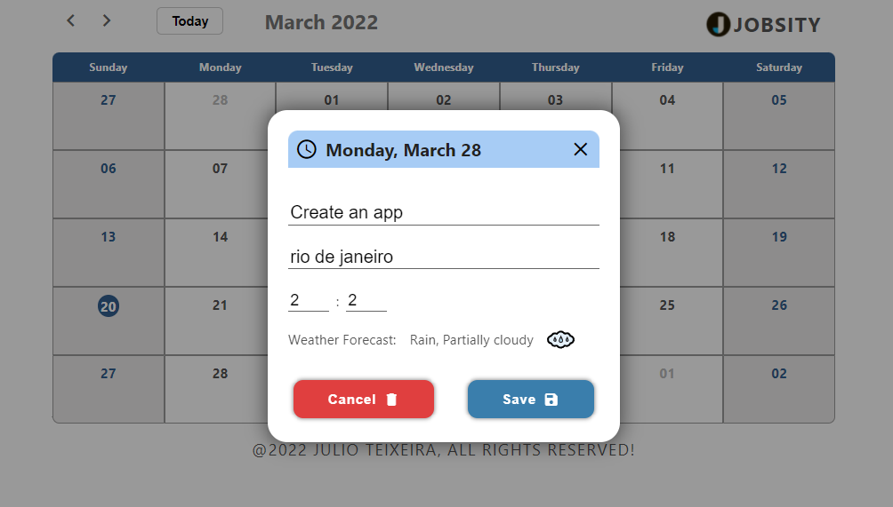

    

# React Challenge for Jobsity

## Screenshots samples

## Deployed App on Heroku
[React-Jobsity-Challenge App](https://react-jobsity-challenge.herokuapp.com/calendar)

## How to deploy
 - Install node >= 16.14 
 - NPM >= 8.5 or Yarn >= 1.22
 - Run `npm install` | `yarn install` to install all dependencies.
 - Run `npm start`   | `yarn run` to run the app locally.
 - Create a .env file on the root folder with:
   - REACT_APP_VISUAL_CROSSING_KEY=N7TD6EXYXS2DUTJRW4G2V5TU9
 - You can find the project running on `localhost:3000`.

## Tecnologies used
- GSAP3 for small animations
- React-router-dom v6 (updated the original one)
- axios for fetching data from Visual Crossing API
- Dayjs library to help with the calendar
- SASS

## Considerations
- Followed the structure of folders suggested
- Used the useReducer hook instead of Redux, since its a small application
- Avoided using pre-made UI components from libraries (mainly for the modal)
  
